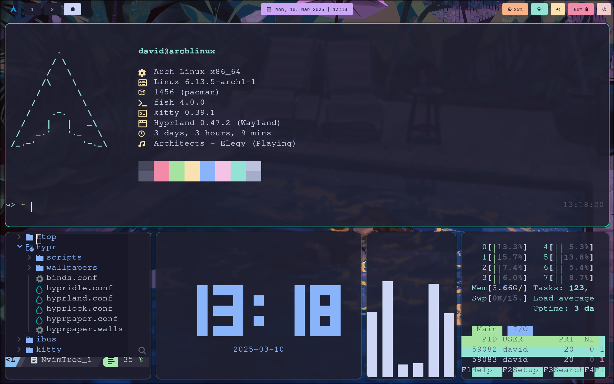
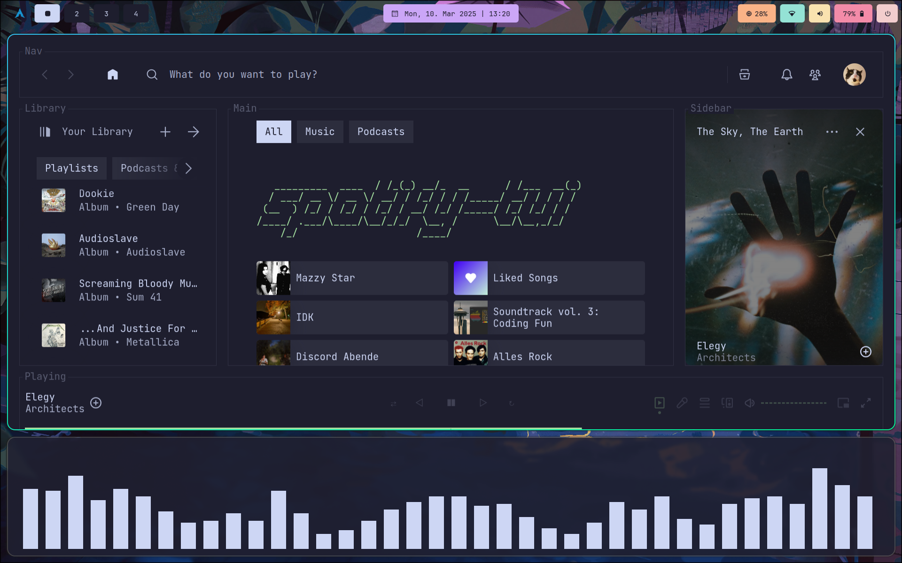

# Dotfiles

This repository contains my carefully curated dotfiles and configuration files for a streamlined Arch Linux workflow with Hyprland. These configurations reflect my personal preferences optimized for productivity, aesthetics, and system performance.

## Terminal Environment  
  - `kitty`: GPU-accelerated terminal emulator  
  - `fish`: User-friendly shell with smart completions  

## Window Management
- `hypr`: Modern Hyprland compositor configurations for a tiling Wayland experience  

## System Utilities
- `waybar`: Customized status bar with workspace management  
- `rofi`/`wofi`: Efficient application launchers  
- `dunst`: Clean notification daemon setup  

## Development Tools
- `nvim`: Vim-fork focused on extensibility and usability  
- `fastfetch`: A feature-rich and performance oriented system information tool  
- `cava`: Cross-platform Audio Visualizer  
- `htop`: Interactive Process viewer  
- `tty-clock`: Clock using lib ncurses  

## Screenshots  

## 📜 Lizenz
MIT
